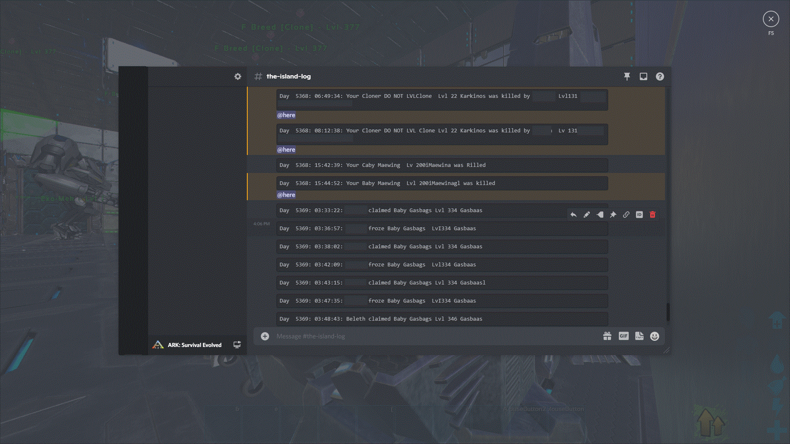
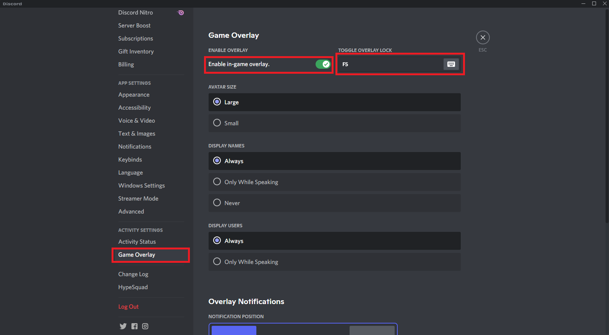
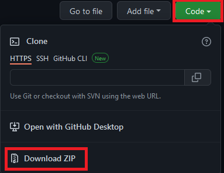
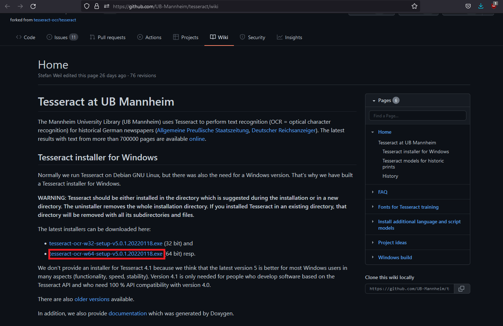
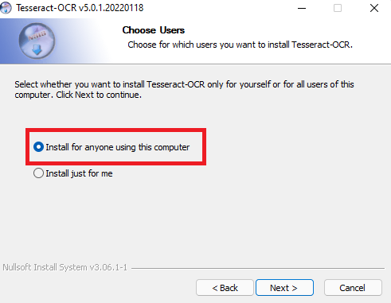
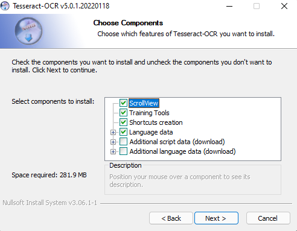
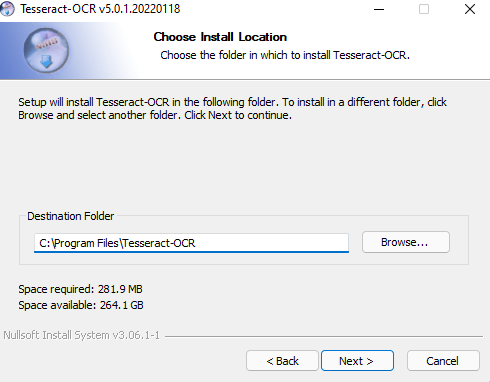
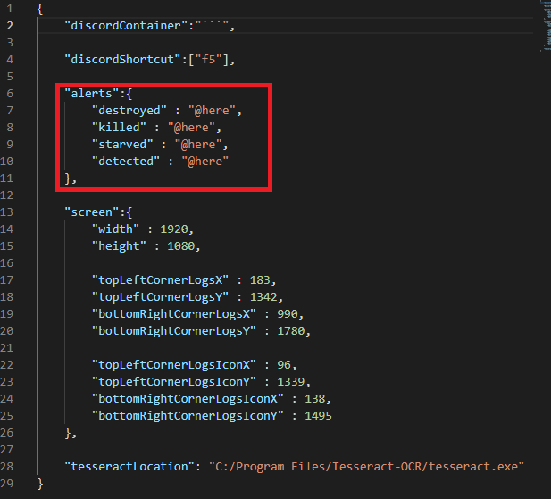

# Open Tribe Logs Bot

Author: Beleth

Contact: beleth.ark@gmail.com

## What is this program?

This program in an open source bot that uses OCR technologies to forward tribe logs of the game ARK Survival Evolved to Discord with customizable alerts.

## Disclaimer:

If this program goes against your server's terms of services, use it at your own risks. The development team of this program will not be held responsible if you get banned.

## Is this program a Virus/Trojan/Malware?

This program is Free and Open Source Software (FOSS) and builds on FOSS and widely used programs and libraries (with the exceptions of ARK Survival Evolved and Windows). As a result, you can check the code to verify that this program is not a malware and none of the dependencies should be problematic on a security standpoint.

## Dependencies and requirements:

### In Game Settings:

There are a few in game requirements that should be met before using the bot:

- Game in English
- Game and monitor in 1080p (Support for different resolutions will be added later)
- The bot is coded to work with the vanilla colors of the game. If you modify the colors or the shaders, the bot might malfunction (ReShade, INI, Nvidia filters, ...)
- In game logs in reverse order (newest first)

### Discord Settings:

This bot uses the in game overlay to communicate with Discord so you shound activate it first. The defaut key used by the bot is F5 but you can modify it to your likings tin the `config.json` file.

Note that the bot will write the logs in the current channel of the overlay so make sure that the current channel of the overlay is the channel you would like the logs to be written in.

### Download the Bot:

You can download the bot by downloading the sources from Github and by extractiong the content of the .zip archive to where you want the bot to be installed.

### Install Python:

This bot is written in Python 3 so if you didn't install already, you can download the latest version on the official website https://www.python.org/!

Make sure to add Python to PATH during the install.

### Install Tesseract:

The program uses Optical Character Recognition (OCR) for extracting text from Images. We use the program Tesseract https://tesseract-ocr.github.io/tessdoc/Home.html#releases-and-changelog to perform such operation (FOSS and developed by Google)

The windows installer can be found at the following address:
https://github.com/UB-Mannheim/tesseract/wiki

We recommend the following settings during the installation:

Note that if you choose a different location, you can specify it in the `config.json` file.

## Launch the program (Once you installed the dependencies):

- Log to your server and place your character to a place where he will be fine (a sleeping pod for example).

- Make sure Discord is running and the overlay version of Discord is set to the logs channel.

- Launch the bot by double-clicking on the `run_bot.bat` script.

- Return to the game and open your logs.

- Enjoy!

## Customize the Alerts:

The `config.json` file contains a dictionary of triggering words and alerts. You can edit if freely. If a trigering word is detected, then the corresponding alert is raised.

## Known Issues:

- Some letters are not recognized properly due to the in game fonts being weirdly cropped (can't really do anything about that).

- Funky words (including player names and dino names) are not properly recognized. This will be patched in future releases but this is fine for now.

- The compatibility for monitors different from 1080p will be added in future releases.

- If the server crashes, the bot has no auto relog function yet and you have to reconnect by hand. Might add this feature latter.

## Acknowledgements:

Part of the code (including some computer vision techniques) is inspired by the project https://github.com/OpenElement-GachaBot.